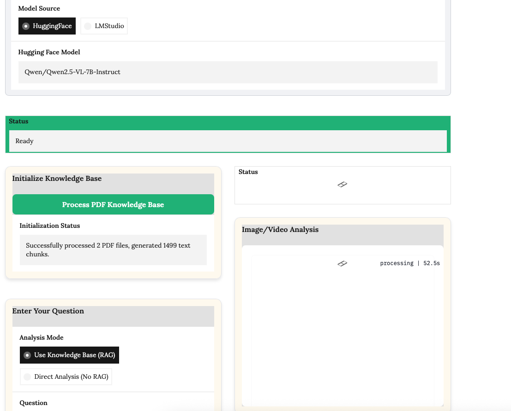
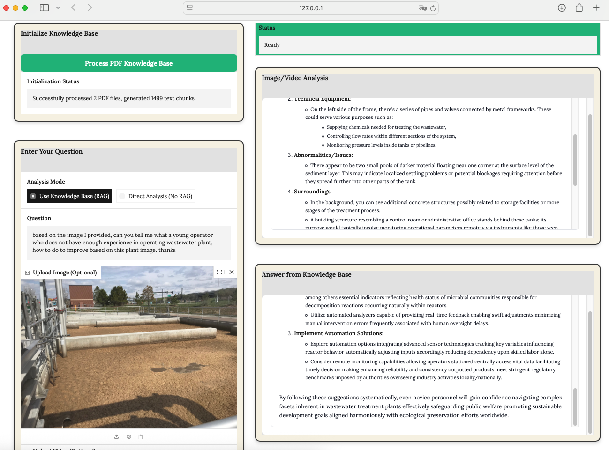
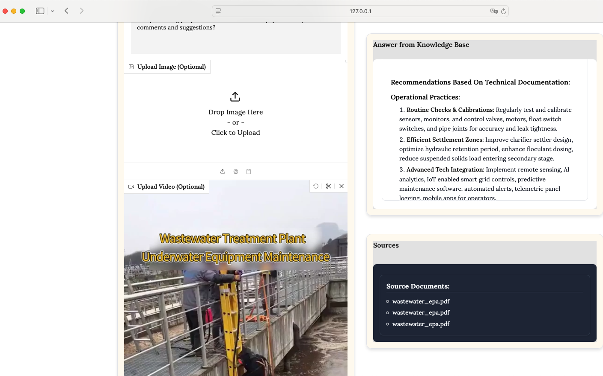
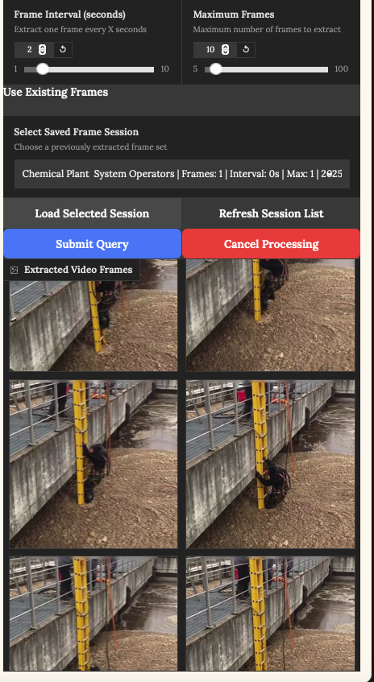
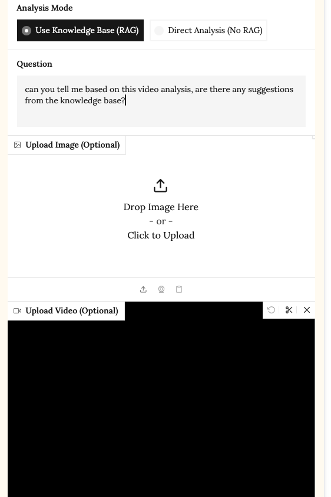

# Multimodal RAG System with LLM Integration



A high-performance, multimodal Retrieval-Augmented Generation (RAG) system that supports text, image, and video queries. This system features integration with both Hugging Face models and locally running LLM servers through LM Studio.

## 🚀 Features

- **Multimodal Processing**: Seamlessly handle text, image, and video queries
- **Model Flexibility**: Switch between Hugging Face models and locally running LLMs in LM Studio
- **Hardware Optimized**: Automatically uses the best available hardware (MPS for Apple Silicon, CUDA for NVIDIA GPUs)
- **High-Performance**: Implements intelligent caching, mixed precision, and parallel processing
- **Beautiful UI**: Clean interface with high-contrast source document display
- **Modular Architecture**: Well-organized code structure for easy maintenance and extension

## 📁 Important Folders

- **RAG_pdf/**: Place your documents here to build your knowledge base (PDFs and other document types supported)
- **image/**: Contains UI assets and system images (must be preserved in repository)
- **frame_cache/**: Used for caching video frames (folder maintained but contents ignored in repository)
- **offload_folder/**: Used for model memory management (folder maintained but contents ignored in repository)

## 🖼️ Screenshots

This application can be used either with RAG (utilizing your knowledge base) or as a pure chatbot (using only the capabilities of the selected LLM model). It integrates with Hugging Face's transformer library and contains the Qwen2.5-VL-7B model by default. You can also install LM Studio and easily switch to any model available there for seamless updates.











**⚠️ Performance Warning**: The response time and quality of the model highly depends on your hardware. The creator tested this on a Mac Mini with 64GB RAM and an M4 chip with good results. Your experience may vary based on your system specifications.

## 🏗️ Architecture

The system uses a modular architecture with clean separation of concerns:

```
LLM_Project/Qwen2.5/
├── launch_rag.py              # Launch script for the application
├── modular_rag/               # Main code directory
│   ├── app.py                 # Application entry point
│   ├── models/                # Model backends
│   │   ├── huggingface.py     # Hugging Face model integration
│   │   └── lm_studio.py       # LM Studio integration
│   ├── rag_modules/           # RAG processing modules
│   │   ├── vector_store.py    # Vector store for document indexing
│   │   └── rag_processor.py   # Core RAG processing for all modalities
│   ├── ui/                    # User interface
│   │   ├── styles.py          # CSS styling
│   │   └── components.py      # UI component definitions
│   └── utils/                 # Utility modules
│       ├── config.py          # Configuration settings
│       └── helpers.py         # Helper functions
└── docs/                      # Documentation
```

## 💡 How It Works

1. **Text RAG**: Queries are matched against indexed documents (PDFs and other file types) using FAISS vector similarity
2. **Image RAG**: Images are analyzed with vision models, then combined with text RAG for context-aware responses
3. **Video RAG**: Video frames are extracted, analyzed individually, and key insights are combined with textual context

### Key Components:

- **Vector Store**: Uses FAISS through LangChain (with TF-IDF fallback) for efficient document retrieval
- **Model Backend**: Supports both Hugging Face models and LM Studio's API-compatible server
- **Video Processing**: Implements frame extraction with caching and parallel processing
- **UI**: Built with Gradio for a clean, responsive interface

## 🖥️ Installation & Usage

### Prerequisites

- Python 3.10+
- [LM Studio](https://lmstudio.ai/) (optional, for using local LLMs)

### Setup

1. Clone this repository:
   ```
   git clone https://github.com/yourusername/multimodal-rag.git
   cd multimodal-rag
   ```

2. Create and activate a virtual environment:
   ```
   python -m venv qwen25_env
   
   # On macOS/Linux
   source qwen25_env/bin/activate
   
   # On Windows
   qwen25_env\Scripts\activate
   ```

3. Install dependencies:
   ```
   pip install -r requirements.txt
   ```

4. Place your documents in the `RAG_pdf` folder (supports PDF and other material types)

### Running the Application

```bash
# Activate the Python environment first

# On macOS/Linux
source qwen25_env/bin/activate

# On Windows
qwen25_env\Scripts\activate

# Then run the application
python launch_rag.py
```

The application will be available at [http://localhost:7860](http://localhost:7860) in your web browser.

### Usage Instructions

1. **Initialize Knowledge Base**: Click the "Process PDF Knowledge Base" button to index your documents (for RAG mode)
2. **Select Model Source**: Choose between Hugging Face (Qwen2.5-VL-7B default) or LM Studio models
3. **Submit Queries**: Enter your text prompt (mandatory) and optionally upload images or videos
4. **View Results**: For RAG mode, see the retrieved contextual information and model-generated responses. For non-RAG mode, view direct model analysis

**Note:** When using non-RAG mode, the answer section will display as "Direct Model Analysis" instead of showing retrieved contexts.

## 🚄 Performance Optimizations

- **Hardware Detection**: Automatically uses MPS for Apple Silicon, CUDA for NVIDIA GPUs, or falls back to CPU
- **Mixed Precision**: Uses FP16 precision when available to improve inference speed
- **Video Frame Caching**: Avoids redundant processing of previously analyzed videos
- **Parallel Processing**: Uses multi-threading for video frame extraction and analysis
- **Memory Management**: Implements efficient cleanup of temporary resources

## 🔌 LM Studio Integration

The system can connect to locally running LLM servers through LM Studio:

1. Run LM Studio and load a model (vision models like Qwen2.5-VL-7B-Instruct or Gemma-3 work best)
2. Make sure the local server is running (typically on http://localhost:1234/v1)
3. In the RAG interface, select "LMStudio" as the model source
4. Choose your model from the dropdown

## 📚 Documentation

For more detailed documentation, see the [docs folder](./modular_rag/docs):

- [Cleanup Guide](./modular_rag/docs/CLEANUP_GUIDE.md) - How to organize the repository
- [RAG Explanation](./modular_rag/docs/RAG_concise_readme.md) - Original system documentation
- [LM Studio Guide](./modular_rag/docs/LM_STUDIO_FIX_GUIDE.md) - LM Studio integration details

## 📜 License

This project is licensed under the MIT License - see the LICENSE file for details.
