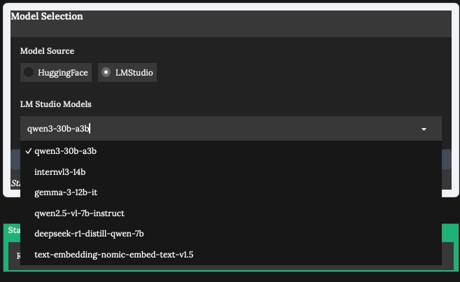
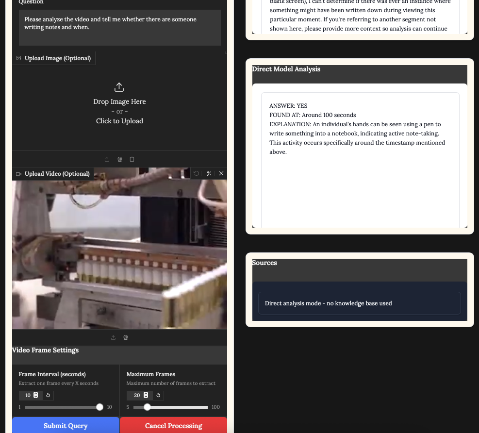
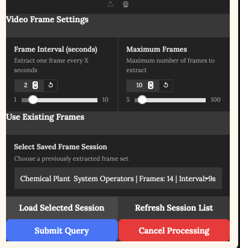

# Multimodal RAG System with LLM Integration


A high-performance, multimodal Retrieval-Augmented Generation (RAG) system that supports text, image, and video queries. This system features integration with both Hugging Face models and locally running LLM servers through LM Studio.

## 🚀 Features

- **Multimodal Processing**: Seamlessly handle text, image, and video queries
- **Model Flexibility**: Switch between Hugging Face models and locally running LLMs in LM Studio
- **Hardware Optimized**: Automatically uses the best available hardware (MPS for Apple Silicon, CUDA for NVIDIA GPUs)
- **High-Performance**: Implements intelligent caching, mixed precision, and parallel processing
- **Beautiful UI**: Clean interface with high-contrast source document display
- **Modular Architecture**: Well-organized code structure for easy maintenance and extension

## 📁 Important Folders

- **RAG_pdf/**: Place your documents here to build your knowledge base (PDFs and other document types supported)
- **image/**: Contains UI assets and system images (must be preserved in repository)
- **frame_cache/**: Used for caching video frames (folder maintained but contents ignored in repository)
- **offload_folder/**: Used for model memory management (folder maintained but contents ignored in repository)

## 🖼️ Screenshots

### Step 1: Model Selection


When you first open the application, you'll need to decide whether to use LM Studio to manage models or the built-in Hugging Face transformer library. If you choose LM Studio, it allows for easy addition or removal of models without changing code.



If you select LM Studio, the application will automatically pull locally available LM Studio models as shown above. Alternatively, if you choose to use the Hugging Face transformer library, currently only the Qwen2.5 VL 7B model is implemented, and you'll need to modify the code to use other models.

### Step 2: RAG vs. Non-RAG Mode


After selecting your model, you can decide whether to use RAG (Retrieval-Augmented Generation) or non-RAG mode. If you select RAG, you'll need to copy your data files into the RAG_pdf folder and then press the "Process PDF Knowledge Base" button. Despite the name suggesting only PDF support, the system actually accepts various material types including Word documents, images, and other formats. After processing the knowledge base, you'll need to provide a text query, such as the example where an inexperienced engineer took a plant picture and asked for suggestions.

### Step 3: Video Analysis


For video analysis, you can upload a video and customize parameters like "Frame Interval" and "Maximum Frames" before starting the analysis process. This gives you control over how the video is processed.



When you use video analysis, the system saves the extracted frames to the "save_frames" folder. In future sessions, you can reuse these saved frames by selecting them from the dropdown menu.

### Step 4: Frame Gallery and Analysis


The loaded frames from previous video analyses will appear in the gallery, allowing you to quickly review frames saved from previous video analyses. You can directly analyze these sequences of images without re-processing the original video.

**⚠️ Performance Warning**: The response time and quality of the model highly depends on your hardware. The creator tested this on a Mac Mini with 64GB RAM and an M4 chip with good results. Your experience may vary based on your system specifications.

## 🏗️ Architecture

The system uses a modular architecture with clean separation of concerns:

```
LLM_Project/Qwen2.5/
├── launch_rag.py              # Launch script for the application
├── modular_rag/               # Main code directory
│   ├── app.py                 # Application entry point
│   ├── models/                # Model backends
│   │   ├── huggingface.py     # Hugging Face model integration
│   │   └── lm_studio.py       # LM Studio integration
│   ├── rag_modules/           # RAG processing modules
│   │   ├── vector_store.py    # Vector store for document indexing
│   │   └── rag_processor.py   # Core RAG processing for all modalities
│   ├── ui/                    # User interface
│   │   ├── styles.py          # CSS styling
│   │   └── components.py      # UI component definitions
│   └── utils/                 # Utility modules
│       ├── config.py          # Configuration settings
│       └── helpers.py         # Helper functions
└── docs/                      # Documentation
```

## 💡 How It Works

1. **Text RAG**: Queries are matched against indexed documents (PDFs and other file types) using FAISS vector similarity
2. **Image RAG**: Images are analyzed with vision models, then combined with text RAG for context-aware responses
3. **Video RAG**: Video frames are extracted, analyzed individually, and key insights are combined with textual context

### Key Components:

- **Vector Store**: Uses FAISS through LangChain (with TF-IDF fallback) for efficient document retrieval
- **Model Backend**: Supports both Hugging Face models and LM Studio's API-compatible server
- **Video Processing**: Implements frame extraction with caching and parallel processing
- **UI**: Built with Gradio for a clean, responsive interface

## 🖥️ Installation & Usage

### Prerequisites

- Python 3.10+
- [LM Studio](https://lmstudio.ai/) (optional, for using local LLMs)

### Setup

1. Clone this repository:
   ```
   git clone https://github.com/yourusername/multimodal-rag.git
   cd multimodal-rag
   ```

2. Create and activate a virtual environment:
   ```
   python -m venv qwen25_env
   
   # On macOS/Linux
   source qwen25_env/bin/activate
   
   # On Windows
   qwen25_env\Scripts\activate
   ```

3. Install dependencies:
   ```
   pip install -r requirements.txt
   ```

4. Place your documents in the `RAG_pdf` folder (supports PDF and other material types)

### Running the Application

```bash
# Activate the Python environment first

# On macOS/Linux
source qwen25_env/bin/activate

# On Windows
qwen25_env\Scripts\activate

# Then run the application
python launch_rag.py
```

The application will be available at [http://localhost:7860](http://localhost:7860) in your web browser.

### Usage Instructions

1. **Initialize Knowledge Base**: Click the "Process PDF Knowledge Base" button to index your documents (for RAG mode)
2. **Select Model Source**: Choose between Hugging Face (Qwen2.5-VL-7B default) or LM Studio models
3. **Submit Queries**: Enter your text prompt (mandatory) and optionally upload images or videos
4. **View Results**: For RAG mode, see the retrieved contextual information and model-generated responses. For non-RAG mode, view direct model analysis

**Note:** When using non-RAG mode, the answer section will display as "Direct Model Analysis" instead of showing retrieved contexts.

## 🚄 Performance Optimizations

- **Hardware Detection**: Automatically uses MPS for Apple Silicon, CUDA for NVIDIA GPUs, or falls back to CPU
- **Mixed Precision**: Uses FP16 precision when available to improve inference speed
- **Video Frame Caching**: Avoids redundant processing of previously analyzed videos
- **Parallel Processing**: Uses multi-threading for video frame extraction and analysis
- **Memory Management**: Implements efficient cleanup of temporary resources

## 🔌 LM Studio Integration

The system can connect to locally running LLM servers through LM Studio:

1. Run LM Studio and load a model (vision models like Qwen2.5-VL-7B-Instruct or Gemma-3 work best)
2. Make sure the local server is running (typically on http://localhost:1234/v1)
3. In the RAG interface, select "LMStudio" as the model source
4. Choose your model from the dropdown

## 📚 Documentation

For more detailed documentation, see the [docs folder](./modular_rag/docs):

- [Cleanup Guide](./modular_rag/docs/CLEANUP_GUIDE.md) - How to organize the repository
- [RAG Explanation](./modular_rag/docs/RAG_concise_readme.md) - Original system documentation
- [LM Studio Guide](./modular_rag/docs/LM_STUDIO_FIX_GUIDE.md) - LM Studio integration details

## 📜 License

This project is licensed under the MIT License - see the LICENSE file for details.